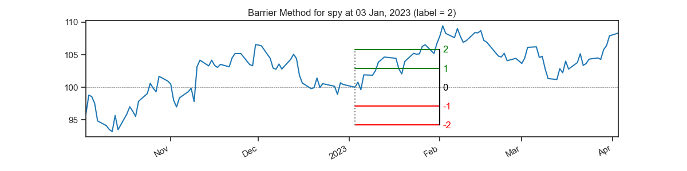
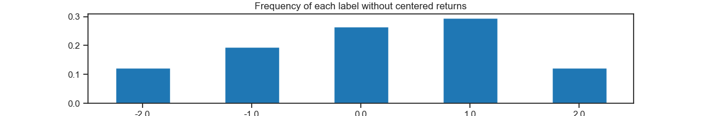
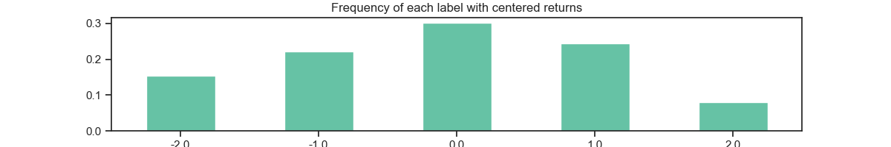

The repository is instpired by it by the `Triple-Barrier Method` suggested by Marcos López de Prado. . I made the following adjustment:

- Extension to multiple barrier conditions, dynamically generated by `n_barriers`
- parameter `center` to center the returns
- readability: Instead of using many for-loops and the like, the focus is set on using the standard data science toolkit with `pandas`, `numpy` etc.
- possibility to export intermediate steps to use as features for models (`_check_barrier_crossing()`)
- handy properties like `transition_probabilities` or `signals_pa`

# Notebooks:

Two notebooks are provided:

1) `example.ipynb`: A notebook giving an example of the class `BarrierMethod`
2) `study.ipynb`: A notebook creating a lot of labels for a a range of `n` and different barriers and some evaluations of them
    -  calculating the different labels
    - testing for normal / uniform distribution

    This gives us some further evaluation regarding a label selection for a new model: E.g. the goal might be to have a new signal (on average) each week which might be normal distributed (neutral most of the time, rare tails) or uniformly distributed 
    

# Examples:

# Triple-Barrier Method

The usual approach to label data is done with a fixed-time horizon. E.g. is the future return in `n` time steps positive?   
Marcos López de Prado suggest the `Triple-Barrier Method` in his book *Advances in Financial Machine Learning* (Wiley, 2018). 

For each observation, three barriers are constructed:   
- a stop-loss barrier (`-1`), indicating a selling opportunity
- a neutral signal (`0`), denoting a scenario where the time series doesn't cross any barrier within a maximum holding period of `n`
- a profit-taking barrier (`+1`), signifying a buying opportunity

### A visual example:

# Installation:

>pip install git+https://github.com/nkonts/barrier-method.git
